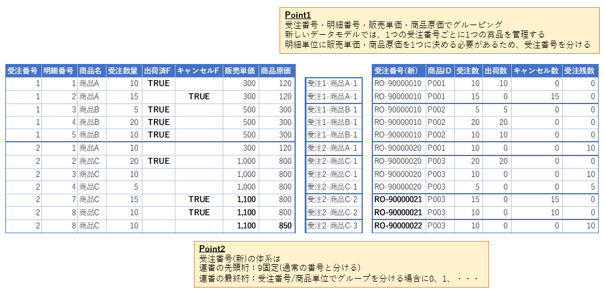
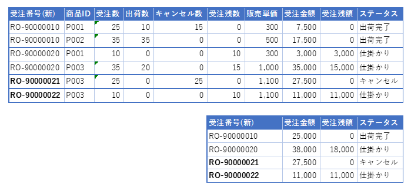

# 移行変換仕様

[戻る](../README.md)

----------

## #1 担当者(operators)

(open)

### <u>Reference</u>

* 【LegacyDB】担当者(operators)

### <u>Table</u>

| # | 名称 | タイプ | 編集元情報 | 編集仕様 |
| -- | -- | -- | -- | -- |
| 1 | 担当者ID (operator_id) | 単純移送 |`operator_id`||
| 2 | 担当者名 (operator_name) | 単純移送 |`operator_name`||

----------

## #2 商品(products)

(open)

### <u>Reference</u>

* 【LegacyDB】商品(products)

### <u>Table</u>

| # | 名称 | タイプ | 編集元情報 | 編集仕様 |
| -- | -- | -- | -- | -- |
| 1 | 商品ID (product_id) | 新規採番 ||※1|
| 2 | 商品名 (product_name) | 単純移送 |`product_name`||
| 3 | 商品原価 (cost_price) | 単純移送 |`cost_price`||
| 4 | 商品管理者ID (product_pic) | 固定値 |ー|Z9999(N/A)|
| 5 | 商品ステータス (product_status) | 固定値 |ー|ON_SALE(販売中)|

#### <u>※1 商品IDの演算</u>

* `商品名`の降順で新たに、`商品ID`を採番する。
* 番号体系は、`P999`（P固定＋数値3桁）で、`P001`、`P002`、・・・とする。

----------

## #3 受注(orders) / #4 受注明細(order_details)

(open)

### <u>Reference</u>

* 【LegacyDB】受注(orders)
* 【LegacyDB】受注明細(order_details)

### <u>Table(受注(orders))</u>

| # | 名称 | タイプ | 編集元情報 | 編集仕様 |
| -- | -- | -- | -- | -- |
| 1 | 受注番号 (order_no) | 演算 |  | ※3 |
| 2 | 受注日 (order_date) | 単純移送 | `order_date` | 日付型に変換 |
| 3 | 受注担当者ID (order_pic) | 演算 | `order_pic` | ※1 |
| 4 | 得意先名称 (customer_name) | 単純移送 | `customer_name` |  |
| 5 | 受注金額 (total_order_price) | 演算 |  | ※4 |
| 6 | 受注残額 (remaining_order_price) | 演算 |  | ※4 |
| 7 | 受注ステータス (order_status) | 演算 |  | ※5 |

### <u>Table(受注明細(order_details))</u>

| # | 名称 | タイプ | 編集元情報 | 編集仕様 |
| -- | -- | -- | -- | -- |
| 1 | 受注番号 (order_no) | 演算 |  | ※3 |
| 2 | 商品ID (product_id) | 演算 | `product_name` | ※2 |
| 3 | 受注数 (receiving_quantity) | 単純移送 | `receiving_quantity` |  |
| 4 | 出荷数 (shipping_quantity) | 演算 | `shipping_flag` `receiving_quantity` | `shipping_flag`により判断 　Trueの場合：`receiving_quantity` 　Falseの場合：0 |
| 5 | キャンセル数 (cancel_quantity) | 演算 | `cancel_flag` `receiving_quantity` | `cancel_flag`により判断 　Trueの場合：`receiving_quantity` 　Falseの場合：0 |
| 6 | 受注残数 (remaining_quantity) | 演算 | `receiving_quantity`…① `shipping_quantity`…② `cancel_quantity`…③ | ①ー②ー③ |
| 7 | 販売単価 (sellling_price) | 単純移送 | `sellling_price` |  |
| 8 | 商品原価 (cost_price) | 単純移送 | `cost_price` |  |
| 9 | 受注ステータス (order_status) | 演算 |  | ※5 |

#### <u>※1 受注担当者IDの導出</u>

* `担当者名`で検索し、`担当者`テーブルから`担当者ID`を導出する。

#### <u>※2 商品IDの導出</u>

* `商品名`で検索し、`商品`テーブルから`商品ID`を導出する。

#### <u>※3 受注番号の演算</u>

* `受注明細`を`受注番号(旧)`、`商品名`、`販売単価`、`商品原価`、でグルーピングして、同一の受注明細とする。
* 同一の`受注番号(旧)`、`商品名`で`販売単価`、`商品原価`の少なくともいずれか一方が異なる場合、移行データについて新システムでは`受注番号(新)`を分けて取り扱う。
* `受注番号`の番号体系は、移行データの受注であることがわかるように、以下とする。（例：`RO-9000010`、`RO-9000021`、・・・）

  |桁数||例|移送元・等|
  |--|--|--|--|
  |1-3|固定値|RO-||
  |4|固定値|9||
  |5-9|移送|00001|元の受注番号|
  |10|演算|0|受注番号が分離される場合の連番|

* 同一の`受注番号(新)`と判断したレコードは集約し、`受注数`、`出荷済数`、`キャンセル数`、`受注残数`は合算する。

#### <u>※4 受注金額/受注残額の導出</u>

* `受注番号(新)`で集約した場合の、`受注金額`、`受注残額`を合算する。

#### <u>※5 受注ステータスの導出</u>

* `受注ステータス`は以下の条件で判断する。

  |判断優先順|条件|ステータス|備考|
  |--|--|--|--|
  |1|`受注残数`>0|仕掛かり||
  |2|`出荷済数`>0|出荷完了|1件以上の出荷実績 (キャンセルはあってもよいが受注残なし)|
  |3|上記以外|キャンセル|全ての商品がキャンセル|

----------
